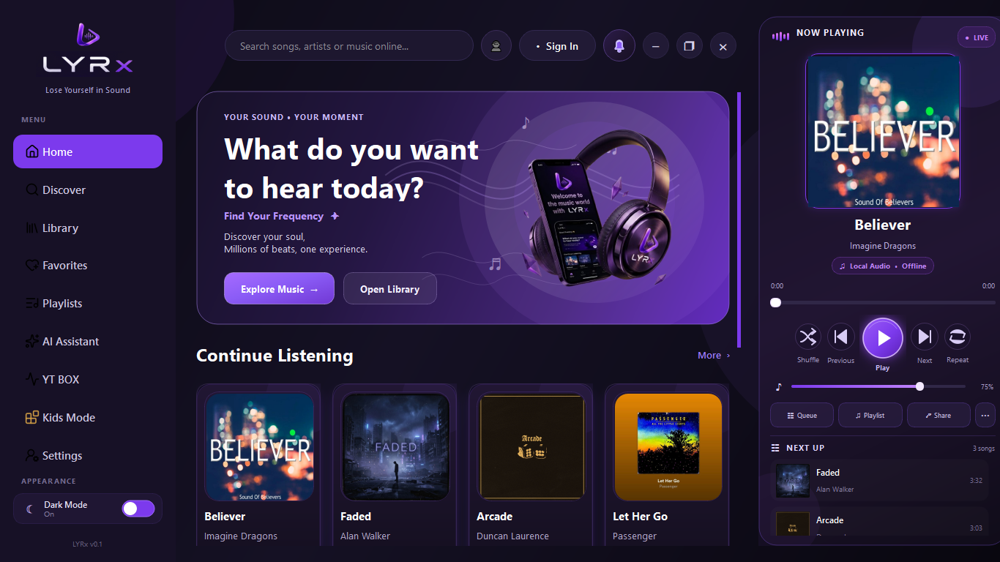
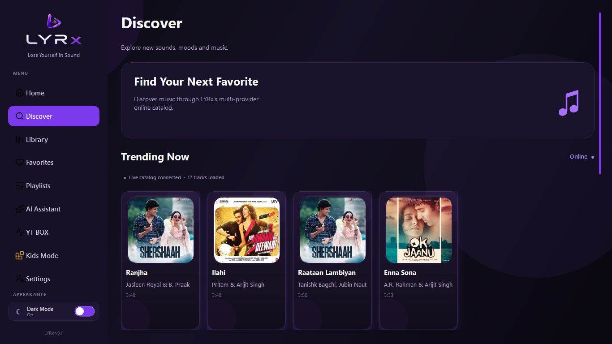
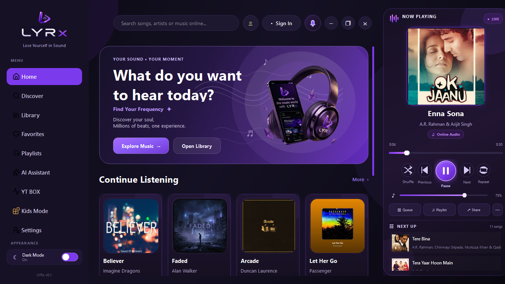
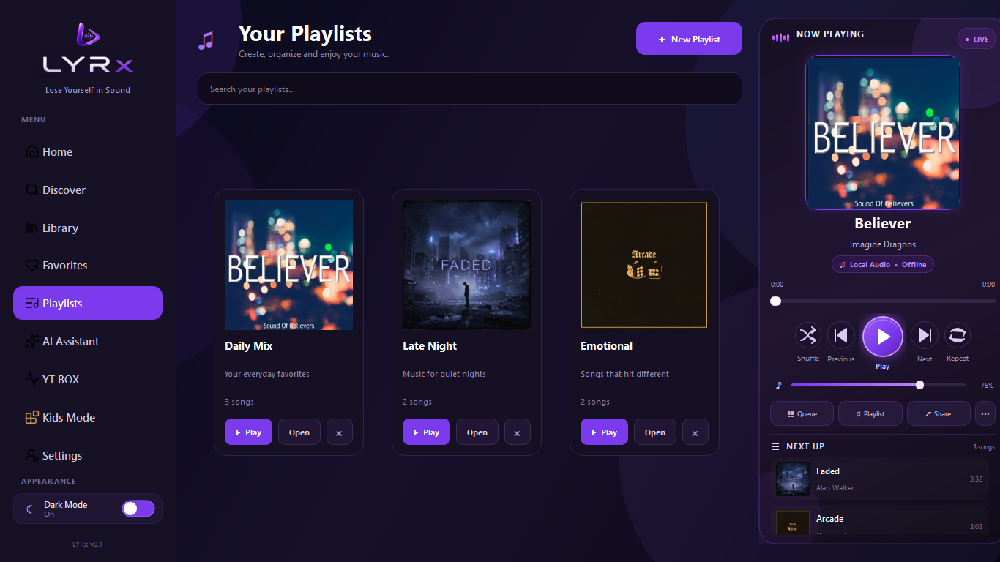
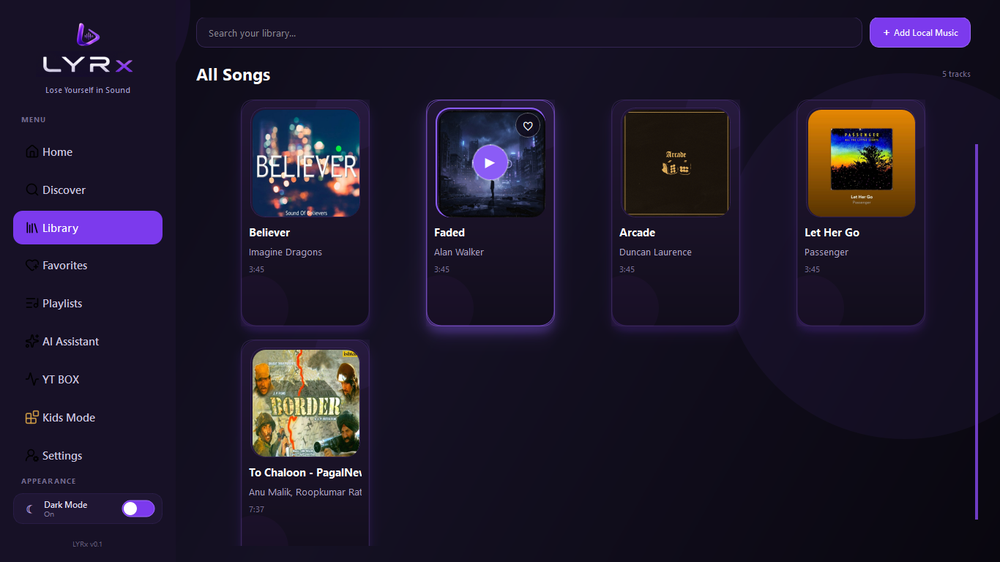
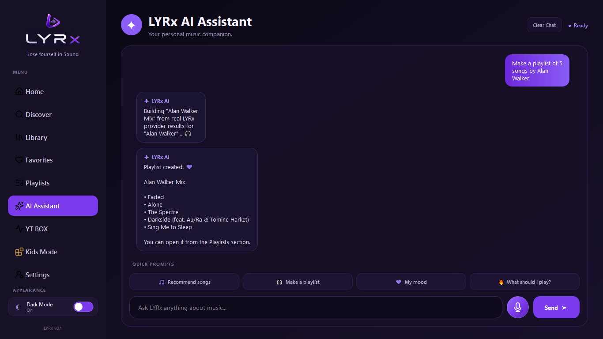
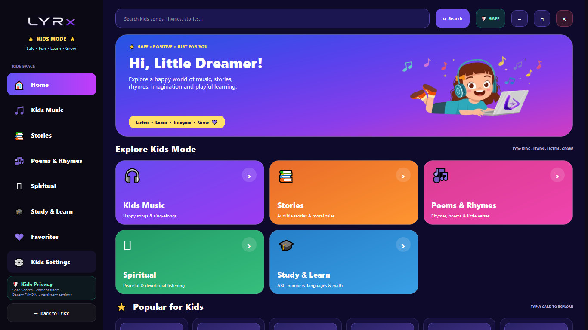
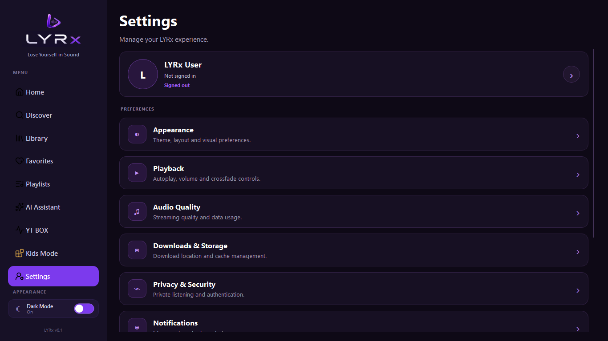

<p align="center">

</p>

<h1 align="center">

</h1>

<p align="center">
<strong>A modular desktop music platform built with Python &
PySide6.</strong>
</p>

<p align="center">
Online discovery • Local music • Playlists • Favorites • AI Assistant •
Kids Mode • Firebase Auth
</p>

------------------------------------------------------------------------

## 🎵 About LYRx

**LYRx** is a Windows desktop music platform designed around a modular
architecture rather than a single monolithic player.

It combines online music discovery through provider integrations with a
real local music library, persistent playlists and favorites, an
application-aware AI Assistant, a dedicated Kids Mode, authentication,
customizable settings, and a polished Now Playing experience.

The project is built as a portfolio-grade application with an emphasis
on:

-   real application state instead of isolated demo UI
-   provider abstraction
-   reusable PySide6 components
-   persistent user data
-   local media metadata and artwork
-   safe separation between playable and downloadable media
-   modular screens and services
-   a production Windows build through PyInstaller

------------------------------------------------------------------------

## ✨ Core Features

### 🏠 Home & Discovery

-   Premium dark/purple LYRx interface
-   Hero banner and personalized-style home sections
-   **Your Vibe** mood shortcuts
-   Expandable mood discovery
-   Mood selections connected to real online Discover searches
-   **Playlists for You** with functional playlist navigation
-   Floating player
-   Responsive music-card based browsing

### 🔎 Online Music

LYRx uses a provider/service architecture so online music sources can be
handled through normalized application models.

Current provider/service integrations include:

-   Spotify integration
-   iTunes integration
-   Jamendo integration
-   YouTube-related workflows
-   Provider-aware playback and search handling

The application normalizes provider results into LYRx's internal song
model so the UI and player do not need to depend on one provider's data
structure.

> Availability and playback behavior depend on the provider and the
> specific track/source.

### 🎧 Now Playing & Playback

-   Full Now Playing screen
-   Play / pause
-   Previous / next
-   Shuffle
-   Repeat
-   Queue / Next Up
-   Animated playback feedback
-   Floating mini-player
-   Online playback
-   Local offline playback
-   Provider-aware source handling
-   Local artwork synchronization
-   Playlist-specific playback and queue integration

LYRx avoids presenting unknown provider bitrate/quality values as facts.
When exact quality information is unavailable, playback is represented
as online audio rather than a fabricated quality label.

------------------------------------------------------------------------

## 💻 Local Music Library

LYRx can work with music stored directly on the user's Windows PC.

### Import

-   Add multiple local audio files
-   Supports common formats including:
    -   MP3
    -   WAV
    -   FLAC
    -   M4A
    -   AAC
    -   OGG
    -   WMA
-   Imported file paths persist between sessions
-   Missing files are ignored when the library is restored

### Metadata

Using **Mutagen**, LYRx can read available:

-   Title
-   Artist
-   Album
-   Duration
-   Embedded artwork

Embedded artwork support includes common:

-   MP3 / ID3 artwork
-   FLAC pictures
-   M4A / MP4 cover artwork

### Local Artwork

Local tracks follow a strict artwork rule:

1.  Use the track's own embedded artwork when available.
2.  Otherwise use the dedicated **LYRx LOCAL** fallback artwork.
3.  Do not reuse unrelated demo-song artwork.

The same local artwork can flow through:

**Library → Now Playing → Floating Player**

### Offline Playback

Local files are played directly through the desktop audio pipeline and
do not require an online provider.

------------------------------------------------------------------------

## ❤️ Favorites

-   Persistent Favorites
-   Online song favorites
-   Favorites browsing
-   Structured multi-column card layout
-   Integration with LYRx playback workflows
-   AI Assistant can work with the user's saved music context where the
    relevant action is supported

------------------------------------------------------------------------

## 📚 Playlists

LYRx supports real user playlist workflows rather than static visual
playlist cards.

-   Create playlists
-   Open playlists
-   Persist playlist data
-   Add online songs
-   Remove playlist songs
-   Playlist-specific playback
-   Playlist queue / Next Up
-   Playlist artwork handling
-   Home playlist shortcuts
-   Modern LYRx-styled playlist notifications and confirmations

Playlist playback uses the actual playable song/source representation
instead of confusing artwork-cache paths with audio paths.

------------------------------------------------------------------------

## 🤖 LYRx AI Assistant

The LYRx AI Assistant is integrated with the application's music state.

Depending on the available provider/player state, it can connect
natural-language requests to actions such as:

-   discovering music
-   playing music
-   working with Favorites
-   creating/working with playlists
-   using saved music context
-   connecting requests to the existing LYRx player and provider
    pipeline

The AI action layer is intentionally connected to LYRx's real stores,
providers and player instead of treating every requested action as a
completed text-only response.

> AI availability and specific actions can depend on configured
> credentials, provider availability and the current application state.

------------------------------------------------------------------------

## 👶 Kids Mode

LYRx includes a separate **Kids Mode** environment designed around a
simpler, child-focused experience.

### Kids Experience

-   Dedicated Kids Mode shell
-   Separate navigation
-   Dedicated Kids Music
-   Stories
-   Poems & Rhymes
-   Spiritual content
-   Favorites
-   Study & Learn
-   Kids Settings
-   Separate Kids player experience
-   Kid-oriented search/content filtering
-   Dedicated Kids artwork and branding

### Study & Learn

The learning area includes interactive categories such as:

-   Alphabets
-   Numbers
-   Hindi वर्णमाला / word learning
-   French basics
-   Colors & Shapes
-   Kids Math
-   visual learning/sticker-style elements

### Safety / Parental Controls

-   Safe Search
-   Content filtering
-   Harmful-content filtering
-   Persistent parental preferences
-   Parent Exit PIN
-   Dedicated Kids Settings
-   Separate Kids Mode environment

Kids Mode is built around:

**Listen • Learn • Imagine**

------------------------------------------------------------------------

## 🔐 Authentication

LYRx includes Firebase-backed authentication workflows.

Implemented authentication paths include:

-   Email / Password
-   Google
-   Microsoft
-   Phone OTP flow

Phone authentication can also be exercised with Firebase test/fictional
phone credentials without requiring the project's production SMS billing
flow.

------------------------------------------------------------------------

## ⚙️ Settings & Personalization

LYRx includes a categorized Settings experience covering areas such as:

-   Profile & Account
-   Appearance
-   Playback
-   Audio Quality
-   Downloads & Storage
-   Privacy & Security
-   Notifications
-   Language & Region
-   Accessibility
-   About LYRx

Additional playback preferences include:

-   Autoplay
-   Gapless-style behavior
-   Crossfade-style transitions
-   Normalize preference persistence
-   Data Saver
-   Provider-aware source preferences where supported

Settings use persistent application state so user preferences can
survive restarts.

------------------------------------------------------------------------

## 🌍 Language Support

The UI includes groundwork for multiple languages, including:

-   English
-   Hindi
-   French

The language architecture is designed so additional UI translations can
be expanded without rebuilding the entire screen structure.

------------------------------------------------------------------------

## 🎬 Cinematic Startup Experience

LYRx includes a branded intro experience with:

-   LYRx intro video
-   Dedicated opening artwork
-   Dedicated closing artwork
-   Purple LYRx visual identity
-   Smooth transition into the main application
-   No manual Skip button in the current release build

The startup flow was tested specifically for black-screen and rendering
issues during integration.

------------------------------------------------------------------------

## 🏗️ Architecture

LYRx follows a modular application structure:

``` text
LYRx
│
├── assets/
│   ├── icons/
│   ├── navigation/
│   ├── album_art/
│   ├── splash/
│   └── kids/
│
├── data/
│   ├── playlist_store.py
│   ├── youtube_favorites_store.py
│   └── discover_data.py
│
├── src/
│   ├── core/
│   │   ├── theme_manager.py
│   │   ├── local_media.py
│   │   └── paths.py
│   │
│   ├── models/
│   │   └── song.py
│   │
│   ├── services/
│   │   ├── music_service.py
│   │   ├── provider_registry.py
│   │   ├── music_provider.py
│   │   ├── spotify_provider.py
│   │   ├── itunes_provider.py
│   │   ├── jamendo_provider.py
│   │   ├── full_track_resolver.py
│   │   ├── youtube_service.py
│   │   └── authentication services
│   │
│   ├── widgets/
│   │   ├── window.py
│   │   ├── sidebar.py
│   │   ├── floating_player.py
│   │   ├── title_bar.py
│   │   └── cards/
│   │
│   └── ui/
│       ├── home/
│       ├── discover/
│       ├── library/
│       ├── favorites/
│       ├── playlists/
│       ├── player/
│       ├── assistant/
│       ├── settings/
│       ├── kids/
│       └── splash/
│
├── requirements.txt
├── .env.example
├── .gitignore
├── LYRx.spec
└── README.md
```

### Main Architectural Idea

``` text
Provider APIs
     │
     ▼
Provider / Service Layer
     │
     ▼
Normalized Song / App Models
     │
     ├──────────────► Home / Discover
     │
     ├──────────────► Favorites
     │
     ├──────────────► Playlists
     │
     ├──────────────► AI Assistant
     │
     └──────────────► Now Playing
                              │
                              ▼
                       Audio Player
                              │
                              ▼
                       Floating Player
```

Local music follows a parallel path:

``` text
Desktop Audio File
       │
       ▼
Mutagen Metadata Reader
       │
       ├── Title
       ├── Artist
       ├── Album
       ├── Duration
       └── Artwork
              │
              ▼
        LYRx Song / Player
```

------------------------------------------------------------------------

## 🧰 Tech Stack

  Technology                     Purpose
  ------------------------------ --------------------------------------
  **Python 3.11**                Application/runtime
  **PySide6 / Qt**               Desktop UI
  **Qt Multimedia**              Audio playback
  **Mutagen**                    Local media metadata/artwork
  **Pillow**                     Image processing
  **Firebase**                   Authentication/backend services
  **yt-dlp**                     YouTube-related workflows
  **PyInstaller**                Windows production packaging
  **QSettings / local stores**   Persistent preferences and app state

------------------------------------------------------------------------

## 📁 Project Structure

The project separates responsibilities instead of putting the complete
application in one Python file.

### `src/widgets/`

Reusable application-level components such as:

-   main window
-   sidebar
-   floating player
-   title bar
-   reusable music cards

### `src/ui/`

Feature-specific screens:

-   Home
-   Discover
-   Library
-   Favorites
-   Playlists
-   Now Playing
-   AI Assistant
-   Settings
-   Kids Mode
-   Splash

### `src/services/`

External-provider and service abstraction:

-   provider registry
-   music service
-   Spotify
-   iTunes
-   Jamendo
-   YouTube-related workflows
-   authentication

### `src/data/`

Persistent/application data stores:

-   playlists
-   YouTube favorites
-   discovery data

### `src/core/`

Shared application infrastructure:

-   theme management
-   local media processing
-   runtime asset/path handling

------------------------------------------------------------------------

## 🖥️ Development Setup

### Requirements

Recommended development environment:

-   Windows 10/11
-   Python **3.11.x**
-   Git
-   VS Code or another Python IDE

### 1. Clone

``` bash
git clone https://github.com/shubham-psingh-dev/SmartMusicPlayer.git
cd SmartMusicPlayer
```

### 2. Create a virtual environment

``` bash
python -m venv .venv
```

Activate it on Windows:

``` bat
.venv\Scripts\activate
```

### 3. Install dependencies

``` bash
python -m pip install -r requirements.txt
```

### 4. Configure environment variables

Copy:

``` text
.env.example
```

to:

``` text
.env
```

Then add the required local credentials/configuration.

**Never commit `.env` to GitHub.**

### 5. Run LYRx

``` bash
python src/main.py
```

If your environment uses the explicit Python 3.11 executable:

``` bat
"C:\Path\To\Python311\python.exe" src\main.py
```

------------------------------------------------------------------------

## 📦 Building the Windows EXE

LYRx uses PyInstaller for its Windows production build.

The repository includes:

``` text
LYRx.spec
build_lyrx.bat
```

The production build is intended to use **Python 3.11**.

Run from the project root:

``` bat
build_lyrx.bat
```

The generated executable is placed under:

``` text
dist\LYRx.exe
```

The production build has been smoke-tested on the development machine
with the bundled application assets, including:

-   main LYRx branding
-   Home hero
-   Kids Mode branding
-   Kids hero
-   splash assets
-   online playback
-   local playback

------------------------------------------------------------------------

## 🔒 Security & Configuration

Private credentials and user-specific runtime data are intentionally kept outside the public source repository.

The following are local/ignored:

```text
.env
user_data/
build/
dist/
__pycache__/
*.pyc
```

------------------------------------------------------------------------

## ⚠️ Current Limitations

LYRx is a personal portfolio/product project and some capabilities
depend on external providers and configuration.

Examples:

-   Online playback depends on provider availability and the selected
    source.
-   Not every provider exposes the same metadata or playback
    capabilities.
-   Download functionality is restricted to
    provider-approved/downloadable sources; a playable URL is not
    automatically treated as a downloadable URL.
-   AI actions depend on configured AI access and the current
    application state.
-   Firebase production SMS authentication has separate provider/billing
    requirements; development/testing can use Firebase test phone
    numbers.
-   Local media metadata depends on what is embedded in the user's audio
    files.
-   Some advanced media-management features can be expanded as the
    library grows.

------------------------------------------------------------------------

## 🗺️ Roadmap

Planned future work may include:

-   deeper local library indexing for very large collections
-   richer ID3/media metadata editing
-   expanded provider integrations
-   additional AI-powered music workflows
-   improved recommendation/personalization systems
-   more Kids Mode learning content
-   expanded accessibility
-   broader language coverage
-   release automation
-   installer/distribution improvements
-   additional Windows testing across clean systems

Roadmap items are **not represented as completed features** until they
are implemented and tested.

------------------------------------------------------------------------

## 📈 Development Milestones

Selected project milestones:

-   [x] Project foundation and PySide6 architecture
-   [x] Home and navigation system
-   [x] Premium music-card and Now Playing UI
-   [x] Automatic next-song playback
-   [x] Shuffle and repeat
-   [x] Persistent Favorites
-   [x] Library playback
-   [x] Dark mode / theme system
-   [x] Playlists
-   [x] LYRx AI Assistant integration
-   [x] Firebase authentication
-   [x] Settings system
-   [x] Offline/local music library
-   [x] Local metadata and artwork extraction
-   [x] Multi-provider online music workflows
-   [x] Language groundwork
-   [x] Kids Mode
-   [x] Kids Study & Learn
-   [x] Kids parental controls
-   [x] Functional Home moods / Your Vibe
-   [x] Functional Playlists for You
-   [x] AI music actions
-   [x] Cinematic splash experience
-   [x] Production Windows EXE build
-   [x] Production asset-bundling smoke test

------------------------------------------------------------------------

## 📸 Product Preview

LYRx is designed as a complete desktop music experience, combining online discovery, local music, playlists, AI interaction, Kids Mode, and personalized settings in one application.

### 🏠 Home



### 🔎 Discover



### 🎵 Now Playing



### 🎼 Playlists



### 📁 Local Music Library



### 🤖 AI Assistant



### 🧒 Kids Mode



### ⚙️ Settings



------------------------------------------------------------------------

## 🌐 Project

### LYRx Website

https://shubham-psingh-dev.github.io/lyrx-website/

### GitHub Repository

https://github.com/shubham-psingh-dev/SmartMusicPlayer

### Windows Release

The latest Windows production build is available from the GitHub Releases page.

------------------------------------------------------------------------

## 👨‍💻 Project Status

**Current stage:** Production release — v1.0.0

The first production Windows executable has been successfully built with:

- Python 3.11.9
- PyInstaller 6.18.0
- Windows 10 x64

The application has been tested from the generated `dist\LYRx.exe`, including bundled visual assets and core playback flows.

**LYRx v1.0.0 has been published as a GitHub Release with the Windows executable attached as a release asset.**

## Update:

**Current stage:** Production release — v1.0.1

LYRx has reached its first production maintenance release with a standalone Windows distribution.

The production executable has been tested outside the development project directory and can run as a standalone `LYRx.exe` without requiring the development `.env` file on the user's computer.

### v1.0.1 Maintenance Update

LYRx v1.0.1 includes:

- Standalone Firebase authentication configuration
- Production EXE no longer dependent on the local `.env` file at runtime
- Improved Windows distribution workflow
- Login and account creation fields start blank for new authentication flows
- Existing music, playlist, favorites, AI, Kids Mode, settings, and authentication functionality preserved

### Release

**Latest release:** `LYRx v1.0.1`

The Windows executable is distributed through the GitHub Releases page.
------------------------------------------------------------------------

## 📄 License

No open-source license is currently declared for this repository.

Until a license is added, the repository's source code remains subject to applicable copyright law. Public visibility does not by itself grant permission to reuse, redistribute, or commercially exploit the source code.

------------------------------------------------------------------------


<p align="center">
Built with Python, PySide6 and a lot of iteration. 💜
</p>

