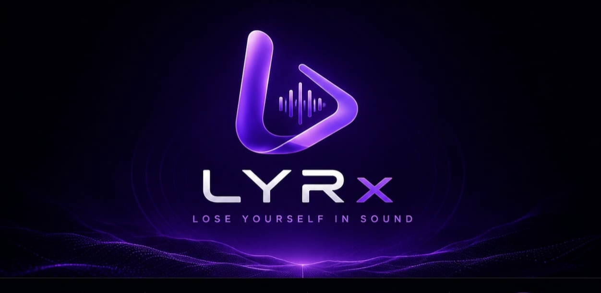

<h1 align="center">🎵 LYRx</h1>

A futuristic offline desktop music player built with Python & PySide6.

# 🎧 LYRx

> Lose Yourself in Sound

LYRx is a modern offline desktop music player built with Python.

Unlike traditional music players, LYRx focuses on a premium user experience with beautiful animations, mood-based music discovery, and a clean modern interface.

---

## Features (Planned)

- Modern UI
- Floating Mini Player
- Album Art Support
- Mood-based Music
- Smart Library
- Lyrics
- Favorites
- Playlists
- Dynamic Themes
- Beautiful Animations

---

## Tech Stack

- Python
- PySide6
- Qt Designer
- Mutagen
- Pillow

---

## Status

🚧 Currently in Development

## Development Progress

- [x] Day 1 - Project Setup
- [x] Day 2 - Git & GitHub
- [x] Day 3 - PySide6 Basics
- [x] Day 4 - Window Foundation
- [x] Day 5 - Hero Banner & Music Cards
- [x] Day 6 - HomeScreen Architecture

Version: Alpha 1.0